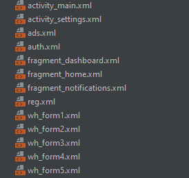

# PSSAndroid
1ая лаб. раб. установлен шаблонный проект и изменен текс с Hello World! на Yarik Krut! 
 
2ая лаб. раб. разобрался с использованием и создаием диаграммы классов PlantUml, загрузил на гитхаб в проект файл получившегося класса

3ая лаб. раб. сделал xml файлы для приложения
